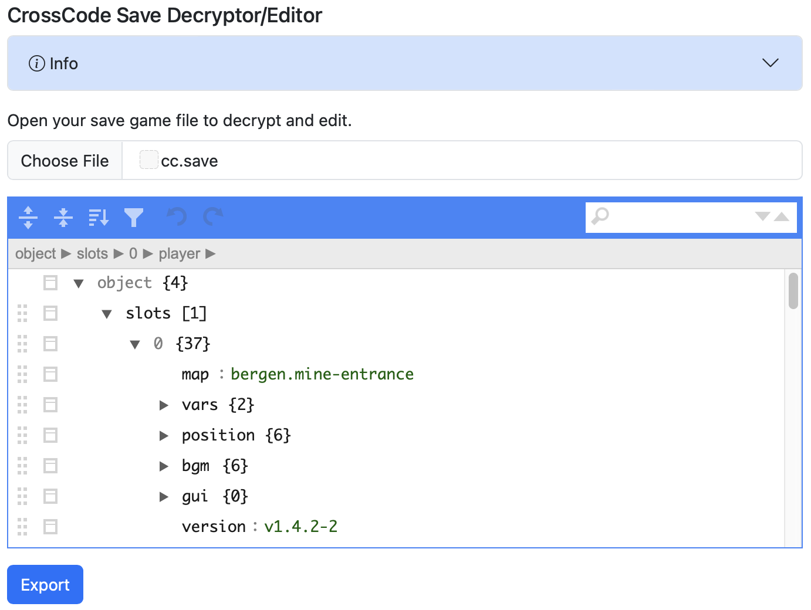

Decrypts the CrossCode save game file (`cc.save`) and provides a basic JSON editor for making changes.  The game already supports reading either encrypted or decrypted save games with no modifications required.

# Info
Basic details of the CrossCode save game location and format can be found here: <a href="https://crosscode.fandom.com/wiki/Savegame">https://crosscode.fandom.com/wiki/Savegame</a>

CrossCode save games are located in the `cc.save` file in these locations:

<table class="table table-bordered table-sm">
    <thead>
        <tr>
            <th>OS</th>
            <th>Path</th>
        </tr>
    </thead>
    <tbody>
        <tr>
            <td>MacOS</td>
            <td>~/Library/Application Support/CrossCode/Default/cc.save</td>
        </tr>
        <tr>
            <td>Linux</td>
            <td>~/.config/CrossCode/Default/cc.save</td>
        </tr>
        <tr>
            <td>Windows</td>
            <td>%LOCALAPPDATA%\CrossCode\cc.save</td>
        </tr>
        <tr>
            <td>Windows (Microsoft Store/Xbox Game Pass)</td>
            <td>%LOCALAPPDATA%\Packages\DECK13.CrossCodePC_rn1dn9jh54zft\LocalCache\Local\CrossCode\cc.save</td>
        </tr>
    </tbody>
</table>

The `cc.save` file is a JSON file, but the values are prefixed with an indicator string (`[-!_0_!-]`), base64 encoded and AES encrypted.  However, the game already supports reading either these encrypted string values *or* plain JSON objects.  The editor takes advantage of this and will export an unencrypted file which the game can read.

# How To Use
  1. Backup your original `cc.save` file.
  2. Download or clone this repo and open <a href="./index.html">index.html</a> in your browser.
  2. Click *Choose File* and load your save file.  Any encrypted values will be decrypted, converted into plain JSON and displayed in the editor.
  3. Make any changes you want.
  4. Click *Export* to download the decrypted (and edited) file
  5. Overwrite your original `cc.save` file.

